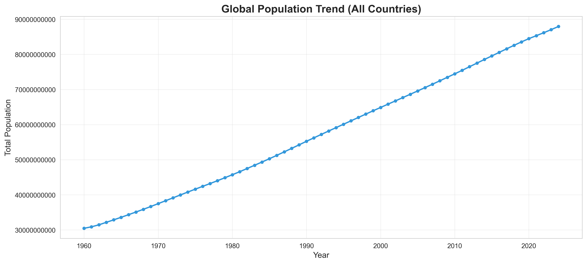
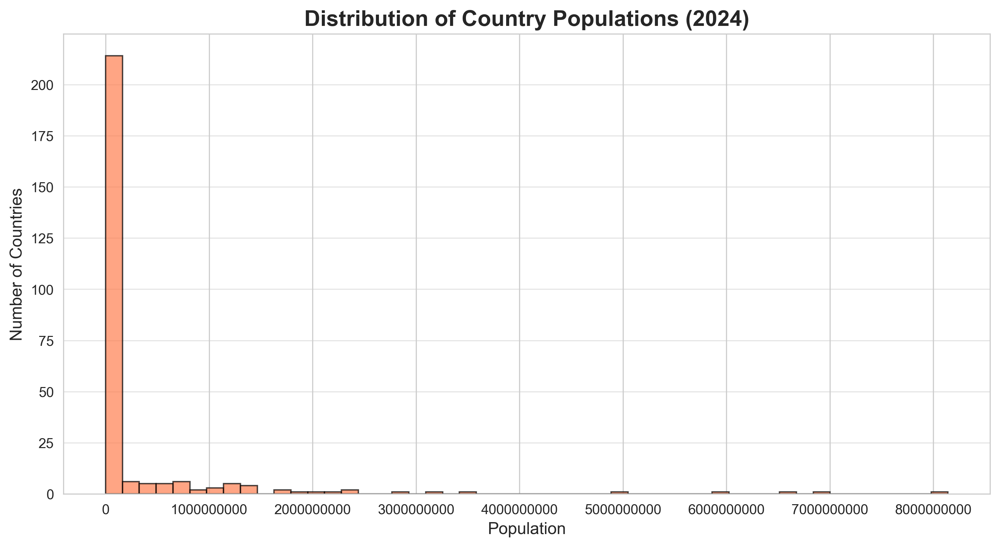
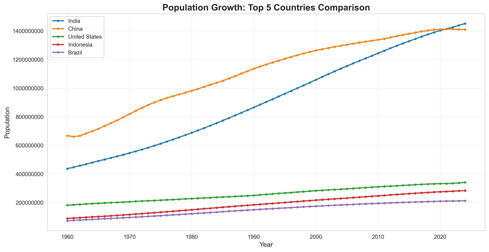

# PRODIGY_DS_01: World Population Data Visualization

## 📊 Project Overview
Analysis and visualization of global population trends using World Bank dataset covering 60+ years of demographic data.

**Internship:** Prodigy InfoTech - Data Science Intern  
**Task:** Task 1 - Population Distribution Analysis  
**Date:** January 2026

---

## 🎯 Objective
Create comprehensive visualizations to analyze:
- Global population trends over time (1960-2023)
- Distribution of population across countries
- Comparative growth analysis of major nations
- Statistical insights into demographic patterns

---

## 📁 Dataset
- **Source:** [World Bank Open Data](https://data.worldbank.org/indicator/SP.POP.TOTL)
- **File:** `API_SP.POP.TOTL_DS2_en_csv_v2.csv`
- **Records:** [Your number] data points
- **Countries:** 200+ nations and territories
- **Time Period:** 1960-2023 (64 years)
- **Features:** Country Name, Country Code, Year, Population

---

## 🛠️ Technologies Used
- **Python 3.10**
- **Libraries:**
  - Pandas 2.3.3 - Data manipulation and analysis
  - NumPy 2.2.5 - Numerical computing
  - Matplotlib 3.10.7 - Data visualization
  - Seaborn 0.13.2 - Statistical visualizations
- **Development:** Jupyter Notebook
- **Environment:** Anaconda

---

## 📈 Methodology

### 1. Data Loading & Exploration
- Imported World Bank CSV dataset (skipped 4 metadata rows)
- Examined dataset structure and data types
- Identified year columns (1960-2023)

### 2. Data Preprocessing
- Reshaped data from wide to long format using `melt()`
- Converted data types (Year to numeric, Population to float)
- Removed missing values and regional aggregates
- Created cleaned dataset for analysis

### 3. Data Analysis
- Calculated global population trends over time
- Identified top 10 most populous countries
- Analyzed population distribution patterns
- Compared growth rates across major nations

### 4. Visualization
Created 4 distinct chart types:
- **Line Chart:** Global population trend (1960-2023)
- **Horizontal Bar Chart:** Top 10 countries by population
- **Histogram:** Distribution of country populations
- **Multi-line Chart:** Comparative analysis (India, China, USA, Indonesia, Brazil)

---

## 🔍 Key Findings

### Global Insights
- **Total World Population (2023):** [Fill in your number] billion
- **Growth Rate (1960-2023):** [Calculate %] increase
- **Average Annual Growth:** [Calculate] people/year

### Top 3 Most Populous Countries (2023)
1. **[Country 1]:** [Population] ([X]% of world)
2. **[Country 2]:** [Population] ([X]% of world)
3. **[Country 3]:** [Population] ([X]% of world)

### Distribution Patterns
- Majority of countries have populations under 100 million
- Population distribution is highly right-skewed
- Top 10 countries account for [X]% of global population

### Growth Trends
- **Fastest Growing:** [Country name] - [X]% increase since 1960
- **Asia** dominates with highest population concentration
- Developed nations show slower growth compared to developing nations

---

## 📊 Visualizations

### 1. Global Population Trend

*Shows exponential growth of world population from 1960 to 2023*

### 2. Top 10 Most Populous Countries

*Horizontal bar chart comparing the 10 most populous nations*

### 3. Population Distribution

*Histogram showing how populations are distributed across countries*

### 4. Country Comparison

*Multi-line chart tracking population growth of 5 major countries*

---

## 📂 Repository Structure
PRODIGY_DS_01/
├── data/
│ ├── raw/
│ │ └── API_SP.POP.TOTL_DS2_en_csv_v2.csv
│ └── processed/
│ └── population_cleaned.csv
├── notebooks/
│ └── task01_analysis.ipynb
├── visualizations/
│ ├── global_population_trend.png
│ ├── top10_countries.png
│ ├── population_distribution.png
│ └── country_comparison.png
└── README.md

---

## 🚀 How to Run

### Prerequisites
```bash
# Install required packages
pip install pandas numpy matplotlib seaborn jupyter

Execution Steps
bash
# 1. Clone repository
git clone https://github.com/rushikesh7325-tech/PRODIGY_DS_01.git
cd PRODIGY_DS_01

# 2. Launch Jupyter Notebook
jupyter notebook

# 3. Open and run task01_analysis.ipynb
# Execute all cells in sequence (Cell → Run All)
